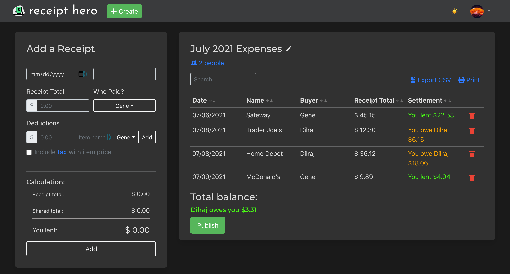

# Receipt Hero

### Project Link: https://receipthero.herokuapp.com/

Receipt Hero is an easy way for people to calculate and track shared expenses and stop worrying about "who owes who".

## Dev

In the project directory, you can run:

### `npm run dev`

This runs the frontend and the server with `concurrently` in development mode.\
Open [http://localhost:3000](http://localhost:3000) to view it in your browser.

The page will reload if you make any edits.\
You will also see any lint errors in the console.
